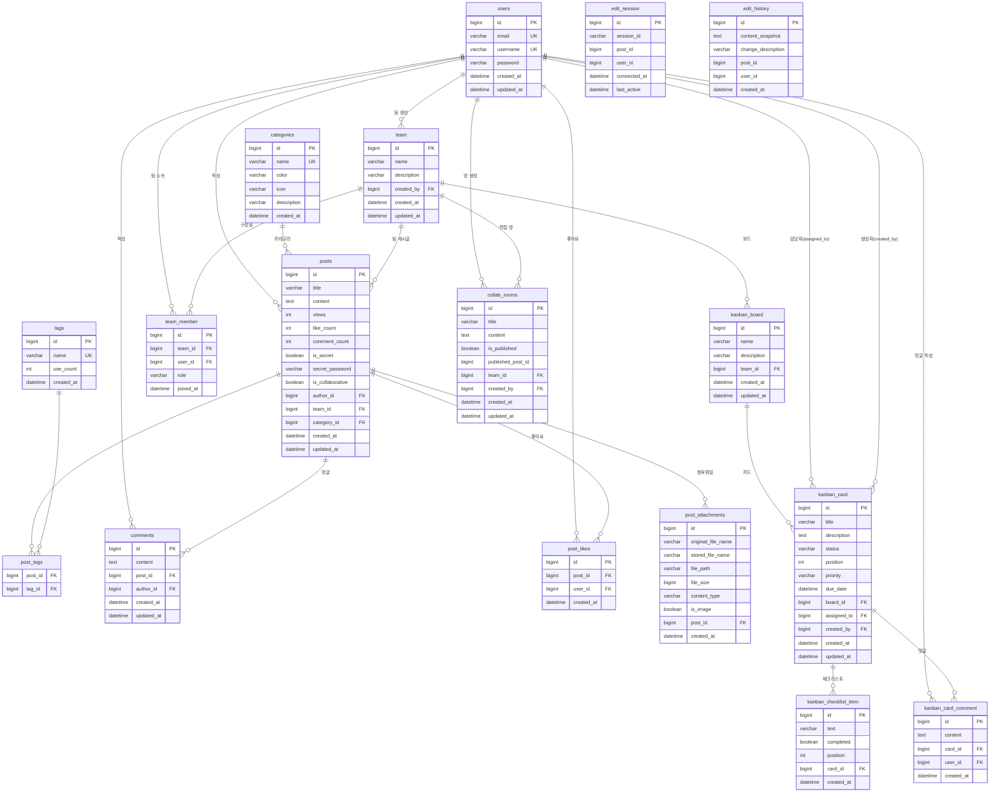

# ERD (Entity Relationship Diagram)

## 테이블 요약

| 테이블 | 설명 |
|--------|------|
| `users` | 회원 (이메일/유저명 UNIQUE) |
| `posts` | 게시글 (비밀글, 팀 게시글, 협업 게시글 포함) |
| `comments` | 게시글 댓글 |
| `post_likes` | 게시글 좋아요 (post_id + user_id UNIQUE) |
| `post_attachments` | 첨부파일 (이미지 포함) |
| `categories` | 게시글 카테고리 (색상/아이콘) |
| `tags` | 태그 (사용 횟수 집계) |
| `post_tags` | 게시글-태그 N:M 중간 테이블 |
| `team` | 팀 |
| `team_member` | 팀 구성원 (OWNER / ADMIN / MEMBER) |
| `kanban_board` | 칸반 보드 (팀 단위) |
| `kanban_card` | 칸반 카드 (TODO / IN_PROGRESS / DONE) |
| `kanban_checklist_item` | 카드 체크리스트 항목 |
| `kanban_card_comment` | 카드 댓글 |
| `collab_rooms` | 공동 편집 방 (발행 시 posts로 전환) |
| `edit_session` | WebSocket 편집 세션 (레거시) |
| `edit_history` | 편집 이력 스냅샷 (레거시) |
