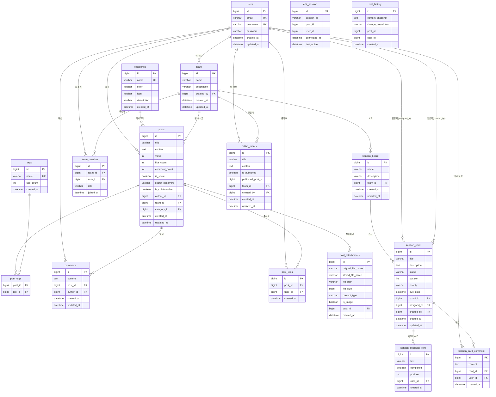

# 통합 협업 + AI 작성 도우미 게시판 플랫폼 - Backend API

Spring Boot + MySQL 기반 통합 협업 플랫폼 백엔드 API 서버입니다.
**게시판**, **칸반 보드**, **팀 공동 편집 방**, **AI 작성 도우미**를 RESTful API와 WebSocket으로 제공합니다.

---

## 🎯 핵심 기능

### 📝 게시판
- JWT 인증 (Spring Security + BCrypt)
- 게시글 CRUD (페이지네이션, 정렬, 검색, 카테고리/태그 필터)
- 파일 업로드 (로컬 저장, UUID 파일명)
- 비밀글 (BCrypt 암호화)
- 댓글 시스템
- 좋아요 (UNIQUE 제약으로 중복 방지)
- 조회수 자동 증가

### 🤝 공동 편집 방
- 팀 기반 편집 방 생성/조회/삭제
- WebSocket(STOMP) 실시간 동시 편집
  - `/app/collab-room/{roomId}/edit` → `/topic/collab-room/{roomId}`
- 내용 자동 저장 (PUT API)
- 편집 완료 시 게시글로 발행 (카테고리/태그 지정)
- 팀원만 접근 가능 (fetch join으로 N+1 없이 권한 검증)

### 📊 칸반 보드
- 팀별 보드 관리
- 카드 CRUD + 드래그 이동 (status/position 변경)
- 우선순위 (LOW/MEDIUM/HIGH/URGENT)
- 체크리스트 (추가/토글/삭제)
- 카드 댓글
- 담당자 지정, 마감일 관리
- WebSocket 카드 이동 실시간 동기화

### 🤖 AI 작성 도우미
- Ollama API 연동 (로컬 LLM)
- 게시글 초안 생성 지원

---

## 🛠️ 기술 스택

| 분류 | 기술 |
|------|------|
| Language | Java 17 |
| Framework | Spring Boot 3.2.1 |
| Security | Spring Security, JWT (HS512), BCrypt |
| ORM | Spring Data JPA, Hibernate |
| DB | MySQL 8.0, Flyway 마이그레이션 (V1~V9) |
| 실시간 | WebSocket, STOMP, SockJS |
| Build | Gradle 8.x |
| AI | Ollama REST API |

---

## 🗄️ ERD (Entity Relationship Diagram)

- [ERD 문서 보기](./docs/ERD.md)



---

## 📁 프로젝트 구조

```
src/main/java/com/example/board/
├── config/
│   ├── SecurityConfig.java          # CORS, JWT 필터, 엔드포인트 권한
│   ├── WebConfig.java               # MVC 설정
│   └── WebSocketConfig.java         # STOMP 브로커 설정
│
├── controller/
│   ├── AuthController.java
│   ├── PostController.java
│   ├── CommentController.java
│   ├── CategoryController.java
│   ├── TagController.java
│   ├── TeamController.java
│   ├── KanbanController.java
│   ├── CollabRoomController.java    # 공동 편집 방 REST
│   ├── CollaborativeEditController.java  # WebSocket 메시지 핸들러
│   └── AIController.java
│
├── service/
│   ├── AuthService.java
│   ├── PostService.java
│   ├── CommentService.java
│   ├── PostLikeService.java
│   ├── CategoryService.java
│   ├── TagService.java
│   ├── TeamService.java
│   ├── KanbanService.java
│   ├── CollabRoomService.java       # 공동 편집 방 비즈니스 로직
│   ├── CollaborativeEditService.java # WebSocket 세션 관리
│   ├── FileStorageService.java
│   └── AIService.java
│
├── repository/
│   ├── UserRepository.java
│   ├── PostRepository.java
│   ├── CommentRepository.java
│   ├── CategoryRepository.java
│   ├── TagRepository.java
│   ├── TeamRepository.java
│   ├── KanbanBoardRepository.java
│   ├── KanbanCardRepository.java
│   ├── KanbanCardCommentRepository.java
│   ├── CollabRoomRepository.java    # findActiveRoomsByUserId, findByIdWithTeamAndMembers
│   ├── PostLikeRepository.java
│   └── PostAttachmentRepository.java
│
├── entity/
│   ├── User.java
│   ├── Post.java
│   ├── Comment.java
│   ├── Category.java
│   ├── Tag.java
│   ├── PostAttachment.java
│   ├── PostLike.java
│   ├── Team.java
│   ├── TeamMember.java
│   ├── KanbanBoard.java
│   ├── KanbanCard.java
│   ├── KanbanCardComment.java
│   ├── ChecklistItem.java
│   └── CollabRoom.java              # 공동 편집 방 엔티티
│
├── dto/
│   ├── request/
│   │   ├── CreatePostRequest.java
│   │   └── UpdatePostRequest.java
│   ├── response/
│   │   ├── PostResponse.java
│   │   └── PostListResponse.java
│   ├── collab/
│   │   ├── CollabRoomCreateRequest.java
│   │   ├── CollabRoomContentRequest.java
│   │   ├── CollabRoomPublishRequest.java
│   │   └── CollabRoomResponse.java
│   └── websocket/
│       ├── CollaborativeEditMessage.java
│       └── KanbanCardMoveMessage.java
│
├── security/
│   ├── JwtTokenProvider.java
│   ├── JwtAuthenticationFilter.java
│   └── UserPrincipal.java
│
└── exception/
    └── GlobalExceptionHandler.java
```

---

## 📋 API 엔드포인트

### 인증
```
POST /api/auth/signup
POST /api/auth/login
```

### 게시글
```
GET    /api/posts                         # 목록 (page, size, sort, categoryId, tagName, keyword)
GET    /api/posts/{id}                    # 상세
POST   /api/posts                         # 작성 (multipart/form-data)
PUT    /api/posts/{id}                    # 수정
DELETE /api/posts/{id}                    # 삭제
POST   /api/posts/{id}/views              # 조회수 증가
POST   /api/posts/{id}/like               # 좋아요 토글
POST   /api/posts/{id}/verify-password    # 비밀글 확인
GET    /api/posts/attachments/{filename}  # 첨부파일 다운로드
```

### 공동 편집 방 (인증 필요)
```
GET    /api/collab-rooms                  # 내 활성 방 목록
POST   /api/collab-rooms                  # 방 생성 { teamId, title }
GET    /api/collab-rooms/{roomId}         # 방 상세
PUT    /api/collab-rooms/{roomId}/content # 내용 저장 { title, content }
POST   /api/collab-rooms/{roomId}/publish # 게시글 발행 { categoryId, tags }
DELETE /api/collab-rooms/{roomId}         # 방 삭제
```

### WebSocket (STOMP)
```
연결: /ws (SockJS)

# 공동 편집 방
발행: /app/collab-room/{roomId}/edit
구독: /topic/collab-room/{roomId}

# 게시글 편집 (레거시)
발행: /app/post/{postId}/edit
구독: /topic/post/{postId}

# 칸반 카드 이동
발행: /app/kanban/{boardId}/move
구독: /topic/kanban/{boardId}
```

### 카테고리
```
GET    /api/categories
POST   /api/categories
PUT    /api/categories/{id}
DELETE /api/categories/{id}
```

### 태그
```
GET /api/tags
GET /api/tags/popular
```

### 댓글
```
GET    /api/posts/{postId}/comments
POST   /api/posts/{postId}/comments
PUT    /api/posts/{postId}/comments/{id}
DELETE /api/posts/{postId}/comments/{id}
```

### 팀
```
GET    /api/teams/my
POST   /api/teams
GET    /api/teams/{id}
GET    /api/teams/{id}/members
POST   /api/teams/{id}/invite
DELETE /api/teams/{id}
```

### 칸반
```
GET    /api/kanban/boards/my
POST   /api/kanban/boards
GET    /api/kanban/boards/{boardId}
POST   /api/kanban/boards/{boardId}/cards
PUT    /api/kanban/boards/{boardId}/cards/{cardId}
DELETE /api/kanban/boards/{boardId}/cards/{cardId}
PATCH  /api/kanban/boards/{boardId}/cards/{cardId}/move
POST   /api/kanban/boards/{boardId}/cards/{cardId}/checklist
PATCH  /api/kanban/boards/{boardId}/cards/{cardId}/checklist/{itemId}/toggle
DELETE /api/kanban/boards/{boardId}/cards/{cardId}/checklist/{itemId}
GET    /api/kanban/boards/{boardId}/cards/{cardId}/comments
POST   /api/kanban/boards/{boardId}/cards/{cardId}/comments
DELETE /api/kanban/boards/{boardId}/cards/{cardId}/comments/{commentId}
```

---

## 🗄️ DB 마이그레이션 (Flyway)

| 버전 | 내용 |
|------|------|
| V1 | users, posts, comments, post_likes |
| V2 | categories |
| V3 | post_attachments |
| V4 | tags, post_tags |
| V5 | team, team_members |
| V6 | kanban_boards, kanban_cards, checklist_items |
| V7 | 카드 태그, 담당자 필드 추가 |
| V8 | kanban_card_comments |
| V9 | collab_rooms |

---

## 🚀 시작하기

### 필수 요구사항
- JDK 17 이상
- MySQL 8.0 이상

### DB 초기 설정

```sql
CREATE DATABASE boarddb CHARACTER SET utf8mb4 COLLATE utf8mb4_unicode_ci;
CREATE USER 'boarduser'@'localhost' IDENTIFIED BY 'your_password';
GRANT ALL PRIVILEGES ON boarddb.* TO 'boarduser'@'localhost';
FLUSH PRIVILEGES;
```

### 환경 변수

`application.yml`은 아래 환경 변수를 참조합니다:

| 변수 | 설명 | 기본값 |
|------|------|--------|
| `DB_USERNAME` | DB 계정 | `boarduser` |
| `DB_PASSWORD` | DB 비밀번호 | (필수) |
| `JWT_SECRET` | JWT 서명 키 (256bit+) | (필수) |
| `FILE_UPLOAD_DIR` | 파일 저장 경로 | `./uploads` |
| `OLLAMA_API_URL` | Ollama API 주소 | `http://localhost:11434` |
| `OLLAMA_MODEL` | 사용할 모델 | `exaone3.5:7.8b` |

### 실행

```bash
./gradlew bootRun                                         # 기본 실행
./gradlew bootRun --args='--spring.profiles.active=dev'  # 개발 프로파일
./gradlew build                                           # 빌드
./gradlew test                                            # 테스트
```

- API 서버: `http://localhost:8080`

---

## 🔐 보안 설정

**공개 (인증 불필요)**
- `GET /api/posts`, `GET /api/posts/**`
- `GET /api/categories/**`, `GET /api/tags/**`
- `POST /api/auth/**`
- `GET /api/posts/attachments/**`
- `OPTIONS /**` (CORS preflight)
- `/ws/**` (WebSocket)

**인증 필요**
- 게시글 작성/수정/삭제, 좋아요
- 댓글 작성/수정/삭제
- `/api/teams/**`, `/api/kanban/**`, `/api/collab-rooms/**`

---

## 👨‍💻 개발자
- **이름**: 이성진
- **기간**: 2026.01 ~
- **역할**: Full-Stack Developer

---

## 📄 라이선스
MIT License
